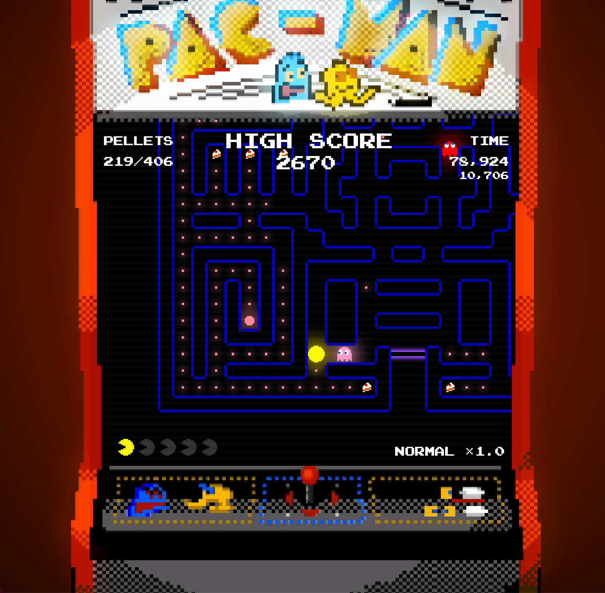
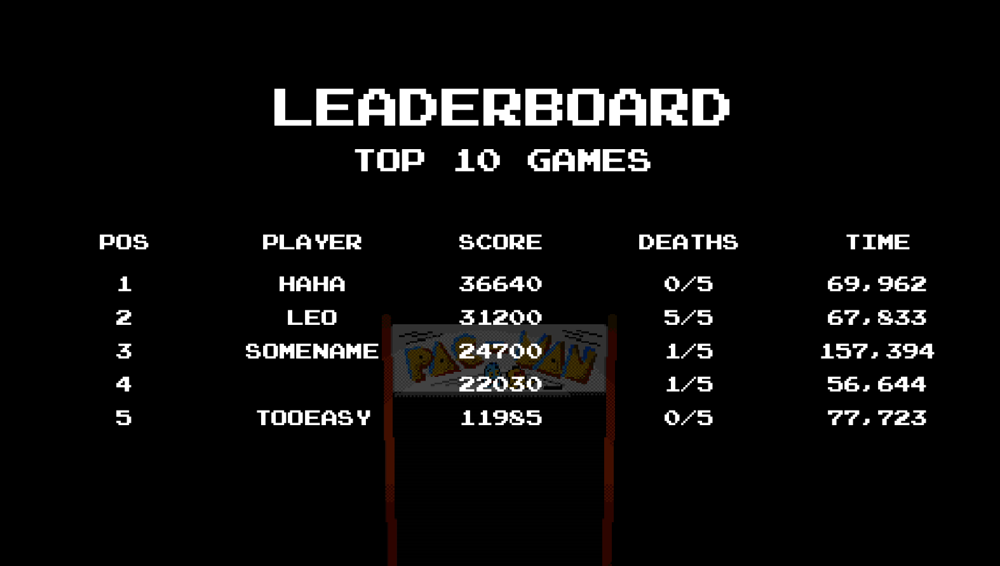
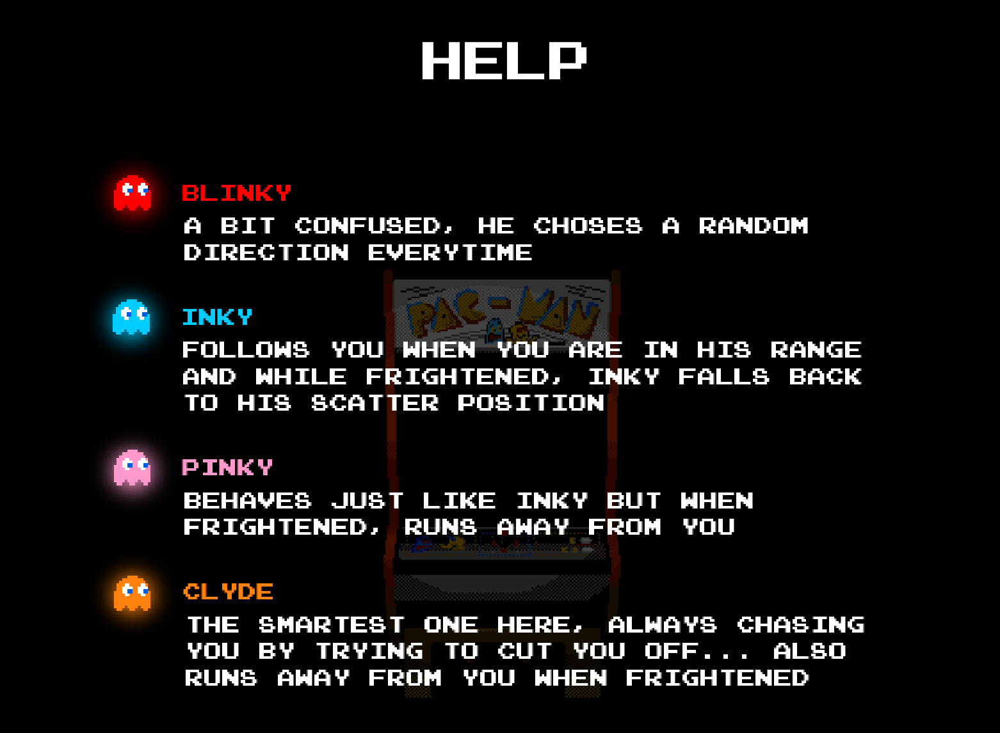
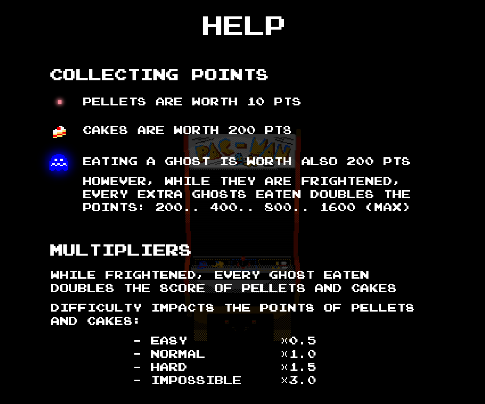

## 0. CONTENTS OF THIS FILE
1. [INTRODUCTION](#introduction)
2. [CONFIGURATION](#configuration)
3. [CONTROLS](#controls)  
    3.1 [Menu Navigation](#menu-navigation)  
    3.2 [Game Navigation](#game-navigation)  
4. [MENUS](#menus)  
    4.1 [Main Menu](#main-menu)  
    4.2 [Options](#options)  
    4.3 [Help](#help)  
    4.4 [Pause](#pause)  
5. [GAMEPLAY FEATURES](#gameplay-features)  
    5.1 [Difficulties](#difficulties)  
    5.2 [Player GUI](#player-gui)  
    5.3 [Leaderboard](#leaderboard)  
    5.4 [Ghost Algorithms](#ghost-algorithms)  
    5.5 [Score/Points System](#scorepoints-system)  
6. [WALK THROUGH](#walk-through)
7. [ADDITIONAL NOTES](#additional-notes)  
    7.1 [Issues with sound](#issues-sound)  
    7.2 [Issues with AreaBehaviour and actors](#issues-areabehavior-actors)  
8. [FINAL WORDS](#final-words)
9. [REFERENCES](#references)  
  9.1 [Art](#art)  
  9.2 [Sound](#sound)  
  9.3 [Animations](#animations)  
  9.4 [Inspiration](#inspiration)  


<a id="introduction"></a>
## 1. INTRODUCTION
We are glad to present to you our project, SuperPacman. We added our own twist to the game, including menus, gameplay tactics
and so much more.  
This document explains everything related to the game and the [CONCEPTION.md](CONCEPTION.md) explains to code aspect of the game.


<a id="configuration"></a>
## 2. CONFIGURATION

1. Open terminal and set directory to project root
  
2. Compile and run the game
    - Solution 1:
        ````shell script
        bash play.sh
        ````
    - Solution 2:
        ````shell script
        /bin/bash play.sh
        ````
    - Solution 3:
        ````shell script
        chmod +x play.sh
        ./play.sh
        ````
    - Solution 4: Run script on IDE
    
    
<a id="controls"></a>
## 3. CONTROLS

<a id="menu-navigation"></a>
### 3.1 Menu navigation
- Press UP and DOWN arrow keys to move up and down the selection of options
- Press ENTER to execute the current selection or to choose sub options
- Press ESC to pause the game

<a id="debug-mode"></a>
##### Debug Mode
- Pressing SHIFT + CTRL + OPTION together activates Debug Mode (can be activated only in menus), to turn it off, the game must be quit and reopened

<a id="game-navigation"></a>
### 3.2 Game navigation
- Use UP, DOWN, LEFT and RIGHT arrow keys to move pacman
- While in [Debug Mode](#debug-mode),
    - Pressing SHIFT + S to activate Speed mode (player movement is boosted). Speed mode can be turned off the same way it was turned on.
    - Pressing SHIFT + G to activate God mode (player becomes invincible). God mode can be turned off the same way it was turned on.


<a id="menus"></a>
## 4. MENUS

<a id="main-menu"></a>
### 4.1 Main Menu
| Option      	| Description                                                  	|
|-------------	|--------------------------------------------------------------	|
| Play        	| Starts the game                                              	|
| Options     	| Shows the configurable options                               	|
| Help        	| Show help page                                               	|
| Quit        	| Terminates the application                                   	|
| Leaderboard 	| Shows leaderboard page with the 10 best games ranked by score |
| Credits     	| Show the credits page                                        	|

<a id="options"></a>
### 4.2 Options
| Option            	| Description                                                     	        |
|-------------------	|-----------------------------------------------------------------	        |
| Difficulty        	| Choose a game difficulty from Easy, Normal, Hard and Impossible 	        |
| Show FPS          	| Toggles the fps counter on and off                              	        |
| Sound             	| Toggles the sound on and off                                          	|
| Glow effect         	| Toggles the glow of sprites on and off                                	|
| Camera smoothing     	| Choose how the camera movement is smoothed (None, Smooth, Very Smooth)   	|
| Camera Shake      	| Toggles camera shake on and off                                        	|
| Clear Leaderboard 	| Clears the leaderboard and deletes tmp files linked to it                	|
| Restore to Default 	| Resets the game options and deletes tmp files linked to it               	|
| Back              	| Returns to main menu                                                  	|


<a id="help"></a>
### 4.3 Help
| Option            	| Description                                                     	|
|-------------------	|-----------------------------------------------------------------	|
| More              	| Provides a more detailed description                           	|

<a id="pause"></a>
### 4.4 Pause
| Option            	| Description                                                     	|
|-------------------	|-----------------------------------------------------------------	|
| Resume            	| Resumes the game                                                	|
| End Game          	| Ends the game without saving it                                 	|


<a id="gameplay-features"></a>
## 5. GAMEPLAY FEATURES

<a id="difficulties"></a>
### 5.1 Difficulties
- EASY
    - difficulty does not increase over time
    - ghosts move slowly
    - ghosts become frightened for 15 seconds
    - ghosts are not the smartest
- NORMAL
    - difficulty increases over time*
    - ghosts move at a normal speed (16 to 12)
    - ghosts become frightened for 10 seconds (stays at 10)
    - ghosts are a bit smarter
- HARD
    - difficulty increases over time
    - ghosts move at a fast speed, up to the same as the player (14 to 10)
    - ghosts become frightened for 8 seconds (8 to 6)
    - ghosts are smart
- IMPOSSIBLE
    - difficulty increases over time
    - ghosts move at a super fast speed, up to a faster speed than the player (12 to 8)
    - ghosts become frightened for 6 seconds (6 to 4)
    - ghosts are even smarter

*(it increases the longer you stay in the same level and resets each time you go to another level)

<a id="player-gui"></a>
### 5.2 Player GUI
---


<a id="leaderboard"></a>
### 5.3 Leaderboard
---


<a id="ghost-algorithms"></a>
### 5.4 Ghost Algorithms
---
  

<a id="scorepoints-system"></a>
### 5.5 Score/Points System
---


<a id="walk-through"></a>
## 6. WALK THROUGH
To complete the game you must finish level 3, by going through level 0, 1 and 2. You have 5 lives, and you must avoid the ghosts
Each level has a certain task you must complete before you can advance to the next level: 

| Level           	    | How to complete                                                     	|
|-------------------	|------------------------------------|
| level0             	| Pick up the key                    |
| levelEPFL (bonus)   	| Pick up all 4 keys                 |
| level1            	| Pick up all pellets                |
| level2            	| Pick up all pellets and 4 keys     |
| level3            	| Pick up all the pellets            |

**Bonus Level:** In level 0, you have the choice to go immediately to level 1 or to pass by the EPFL level.
By passing though the bonus level, you can obtain more points, therefore a higher score. However, be prepared for this EPFL level or you will get caught off guard.
   
**Objective:** Pick up all pellets in each level and all the cakes to get the highest score.
Time is being tracked so be fast! And most importantly... HAVE FUN!!! :)


<a id="additional-notes"></a>
## 7. ADDITIONAL NOTES

<a id="issues-sound"></a>
### 7.1 Issues with sound
You may experience issues with the audio of the game. The audio might make the game slow due to slow loading of audio files. 
For some computers the audio might not work. We asked how to solve this on Piazza. https://piazza.com/class/ketlp0hratwg5?cid=1983

<a id="issues-areabehavior-actors"></a>
### 7.2 Issues with AreaBehaviour and actors

While playing the game, in some very specific conditions, behavior between actors can be skipped.
Here is a better description of the problem on Piazza: https://piazza.com/class/ketlp0hratwg5?cid=2240

This can also happen while unregistering actors, making the cell in question contain the old behavior. To illustrate, 
when pacman dies, it can happen that the ghost who killed him might not leave the cell properly. Therefore, when Pacman 
comes in contact with the cell where he died, he dies again...

<a id="final-words"></a>
## 8. FINAL WORDS
We feel fulfilled as this project comes to an end. There is of course a lot of room for improvement, but completing this 
games allowed us to better understand so many concepts.
We would like to Thank you for taking the time to go through our project.
We rest at your disposal to answer any questions. Our e-mails:
[leonard.cseres@epfl.ch](mailto:leonard.cseres@epfl.ch), [karlis.velins@epfl.ch](mailto:karlis.velins@epfl.ch)

#### We hope you enjoy the game, 
Leonard and Karlis


<a id="references"></a>
## 9. REFERENCES
<a id="art"></a>
### 9.1 Art
- jdaster64 - SuperPacman sprites: [https://www.spriters-resource.com/game_boy_gbc/mspacman/sheet/25056/](https://www.spriters-resource.com/game_boy_gbc/mspacman/sheet/25056/)
- Arcade pixel art: [https://www.wallpaperflare.com/ahoy-arcade-arcade-machine-space-invaders-pac-man-artwork-wallpaper-udovr](https://www.wallpaperflare.com/ahoy-arcade-arcade-machine-space-invaders-pac-man-artwork-wallpaper-udovr)
- "Emulogic" font: [https://www.classicgaming.cc/classics/pac-man/fonts](https://www.classicgaming.cc/classics/pac-man/fonts)
- Arrow keys pixel art: [http://pixelartmaker.com/art/7efa119103ffc71](http://pixelartmaker.com/art/7efa119103ffc71)

<a id="sound"></a>
### 9.2 Sound
- Inthegrave & NamelessSpriter - Pacman sounds: [https://www.sounds-resource.com/arcade/pacman/sound/10603/](https://www.sounds-resource.com/arcade/pacman/sound/10603/)
- Menu sounds: [https://kenney.nl/assets/interface-sounds](https://kenney.nl/assets/interface-sounds)

<a id="animations"></a>
### 9.3 Animations
- Mathematical easing functions: [https://easings.net](https://easings.net)

<a id="inspiration"></a>
### 9.4 Inspiration
- Hyago Oliveira - Pacman in Unity with post processing: [https://connect.unity.com/p/pac-man-g](https://connect.unity.com/p/pac-man-g)
- Retro Game Mechanics Explained - Pac-Man Ghost AI Explained: [https://www.youtube.com/watch?v=ataGotQ7ir8](https://www.youtube.com/watch?v=ataGotQ7ir8)
- Retro Game Mechanics Explained - Pac-Man Kill Screen Explained: [https://www.youtube.com/watch?v=NKKfW8X9uYk](https://www.youtube.com/watch?v=NKKfW8X9uYk)